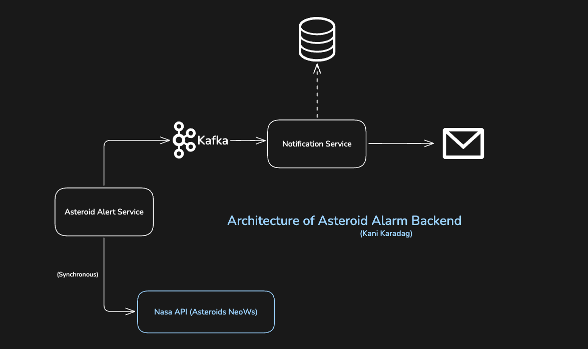

# Asteroid Alerting System

A small application that monitors potentially hazardous asteroids using NASA's NeoWs API and sends real-time email notifications to subscribed users. The system fetches asteroid data, identifies close approaches to Earth, and publishes collision events via Kafka to a notification service. Users with enabled notifications receive automated email alerts containing asteroid details such as name, approach date, estimated diameter, and miss distance. **Not production-ready. Built for personal interest and experimentation.**

## Microservice Architecture Overview


 

## Tech Stack
- Java (Spring Boot)
- Apache Kafka
- PostgreSQL
- Hibernate
- Docker
- Mailtrap
- NASA NeoWs API

## How to use it

1. Clone repository
```
git clone https://github.com/2002kani/asteroid-alert-notifier.git
cd asteroidservice
```

2. Start Docker Container
```
docker compose up -d
```

3.1 Configure Environment Variables
For Asteroid Service:
```
NASA_API_KEY=your_nasa_api_key // Or use the DEMO_KEY
```
3.2 For Notification Service:
```
MAIL_USERNAME=your_mailtrap_username
MAIL_PASSWORD=your_mailtrap_password
EMAIL_FROM=noreply@asteroid-alert.com
```
 
